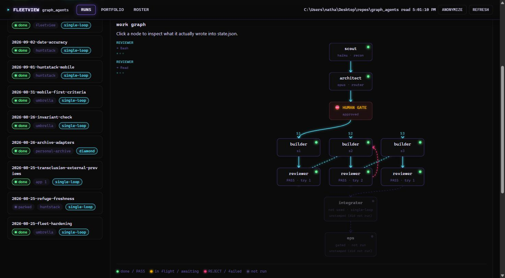

# FleetView

**See what your agent fleet actually did — not what it says it did.**

FleetView is a local, read-only viewer for agent-fleet run state. Point it at a fleet
directory and it renders the work graph of every run, the live node roster, and the
portfolio of apps the fleet operates on — all read straight from the JSON the agents
themselves wrote to disk. Nothing is summarized, cached, or reconstructed from a log:
if a node claims it passed, you can click through and read the exact findings it wrote.

```bash
python fleetview/serve.py
```

Opens `http://127.0.0.1:8787/`. No dependencies, no build step, no install, no network
access — just the Python 3 standard library and a browser.



## Why

A multi-agent run produces a lot of state and very little of it is visible while the run
is happening. `state.json` tells you what each node concluded; it doesn't tell you what's
running right now, whether a slice looped through a rejection before it passed, or which
node has been sitting idle for twenty minutes. FleetView exists to answer those questions
by reading the same files your agents already write — no extra instrumentation, no agent
changes, no second source of truth to keep in sync.

## Routers

The runs FleetView renders come from **routers** — thin `SKILL.md` files under a fleet's
`.claude/skills/` that turn a request into a work-graph run (or, for a couple of them, into
a check that runs outside the graph entirely). FleetView doesn't depend on any of them —
it reads run state by format, the same way it reads everything else — but knowing what
produced a run makes its shape easier to read. As of this writing, a `graph_agents`-style
fleet ships six:

| Router | What it does |
|---|---|
| `feature-graph` | The main one. Turns a goal into a scout → architect → human gate → single-loop-or-diamond run. |
| `new-app` | Scaffolds a new standalone app under the umbrella — own repo, own `CLAUDE.md`, registered in the portfolio index. |
| `fleetview` | Launches this viewer, pointed at a fleet. |
| `close-run` | Checks whether a run may be marked done: audit clean, gate passed, every slice built and reviewed `PASS`, and — the check nothing else makes — the work actually merged in git. Never writes; prints the close for a human to write. |
| `audit-fleet` | Re-verifies a fleet's `CURRENT-STATE.md` against disk and reports only drift, instead of trusting whoever last hand-edited it. |
| `postmortem` | Reviews a finished run's `activity.jsonl`/`state.json` for what its shape actually cost and caught — tool counts, diamond concurrency, slice round-trips, whether risk tags earned their keep. Read-only, never gates. |

Two more were scoped and deliberately left unbuilt when this list was drawn up — `/resume`
(read `CURRENT` + state + activity, print the board, say what step you're on) and
`/copy-pattern` (operationalize "copy, don't couple": copy a pattern across apps, strip
cross-references, record provenance) — plus two ruled out for now: an `/ops-gate` router
(the node it would wrap has never executed, so a router for it would encode guesses about
an untested workflow) and a `/scope`/`/triage` router (the judgment it would wrap is one
paragraph, and wrapping it just adds a second decision about whether to invoke the wrapper).

## Features

### The work graph, drawn from what actually happened

Every run renders as a graph, not a checklist. The shape comes straight from the
architect's own decision — a `diamond` draws a real fan-out and fan-in across parallel
builders and reviewers, a `single-loop` draws the sequential hand-off it is. Node color
is state, not decoration: green for done or PASS, amber for in-flight or awaiting
approval, red for a REJECT or a failure, grey for a node that never ran. Click any node
to read exactly what it appended to `state.json` — a scout's facts, unknowns and risks;
an architect's rationale and its NOT DOING list; a builder's changed files and gate
results; a reviewer's findings, attempt by attempt.

### Rejections are history, not failure

A slice that gets rejected and then fixed doesn't just turn green and forget it happened.
FleetView draws the loop back to the builder and shows the *final* verdict, with a pill
calling out how many reject loops the run went through — visible in the screenshot above.
When a slice went through more than one review attempt, its findings render side by side
instead of stacked, so you can see exactly what changed between the rejection and the
pass that followed it.

### Live while it's running

While any run in the fleet is active — scouting through integrating — a pulsing indicator
appears in the header and the page auto-refreshes every 4 seconds, so you can watch a run
progress without touching Refresh. It turns itself off the moment nothing is active, and
disk is re-read on every request: what you're looking at is never more than a few seconds
stale.

### Multiple fleets, one viewer

Register more than one fleet and a switcher appears in the header in place of the static
path. Switching fleets re-fetches the graph without a page reload and resets the selected
run, since a run id from one fleet means nothing in another.

```bash
python fleetview/serve.py --fleet ../a/graph_agents --fleet ../b/graph_agents
```

### Search, filter, and shareable links

A search box above the run list filters by run id, goal text, app, or status. Selecting a
run, a node, or a tab updates the URL fragment, so copying the address bar hands someone
the exact same view, reloading never loses your place, and the browser's back button steps
back through runs and tabs the way you'd expect.

### Portfolio and Roster

Two more tabs beyond the run graphs: **Portfolio** renders the static app graph from the
fleet's own registry index, and **Roster** shows the agent nodes read live from their
`.claude/agents/` frontmatter — model tier, tool grants, and whether each one has ever
actually run. This is the real definition the orchestrator spawns from, not a copy that
can drift out of sync with it.

### Anonymize before you share

One toggle redacts every identifier the fleet knows — app names, run ids, goal text, file
paths, pasted command output, home directories, email addresses — everywhere they appear
on the page, not just in the obvious field. Flip it before taking a screenshot for anyone
outside your own machine.

## Pointing it at a fleet

FleetView reads a **format**, not a fixed location. It resolves the fleet directory in
this order:

1. `--fleet <path>` (repeatable — see Multiple fleets above)
2. `$FLEETVIEW_FLEET`
3. auto-detection: `./graph_agents`, then `.`, then `../graph_agents`

A directory qualifies by shape — it contains `.graph/runs/` and/or `.claude/agents/`. If
none is found the app still starts and tells you where it looked; a viewer with nothing
to view is a legitimate state, not a crash.

```bash
python fleetview/serve.py --fleet ../elsewhere/graph_agents
python fleetview/serve.py --port 8788 --no-open
```

## Notes

- **It is a viewer.** No route writes anything. If a run looks wrong here, the state is
  wrong — fix the state.
- Disk is re-read on every request, so a run still executing updates on **Refresh**, or
  on its own while it's active (see auto-refresh above).
- **Anonymize** knows an app from the registry, from a run's `app` field, or from a
  directory beside the fleet; an app named only in prose that matches none of those can
  still slip through, so it makes a screenshot safe to share rather than
  publication-grade.
- Binds `127.0.0.1` by default. Nothing here is authenticated — don't bind it wider.
- A run directory with an unparseable `state.json` shows as a visible error row rather
  than silently vanishing. Showing what is actually on disk is the whole point.

## Layout

```
fleetview/
  serve.py      http.server: / and /api/graph, assembled from disk per request
  index.html    self-contained page — vanilla JS, no framework, no CDN
  CLAUDE.md     architecture, constraints, and the format it reads
  docs/         screenshots and other reference assets
```
